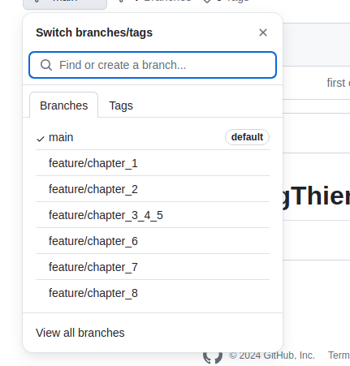

# training_ror_HoangThien
Source code for each chapter is placed in feature/chapter_x branch corresponding to that chapter. Switch the branch to view.

*Chapter 3,4,5 are placed in one code due to few changes through chapters (branch feature/chapter_3_4_5)
Thank you for viewing!

Ruby version 3.0.6
Rails version '~> 7.1.3', '>= 7.1.3.2'